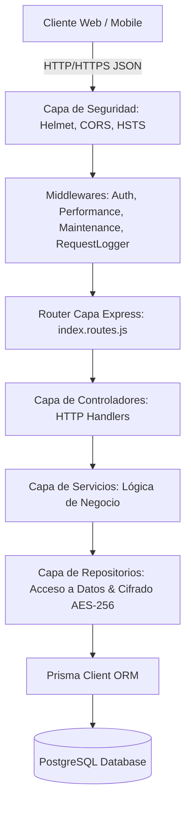

# 01. Macro Arquitectura y Clean Architecture en EMPLIFI

## 1. Visión General de la Arquitectura

El sistema **EMPLIFI** adopta una arquitectura desacoplada y orientada a capas basada en los principios de **Clean Architecture** e **Inversión de Dependencias (DIP)**. El backend está construido en Node.js mediante Express y Prisma ORM sobre PostgreSQL, garantizando alta cohesión, modularidad y facilidad de auditoría.

---

## 2. Descripción de Capas Técnicas

### 2.1. Capa de Entrada y Seguridad
- **Helmet Middleware**: Enforza cabeceras de seguridad CSP, HSTS (`max-age=31536000`), X-Frame-Options (`DENY`) y X-Content-Type-Options (`nosniff`).
- **CORS Config**: Valida orígenes autorizados (`http://localhost:5173`, dominios de Vercel/Producción) con soporte de credenciales HTTP.
- **Maintenance Middleware**: Intercepta peticiones cuando el sistema entra en modo mantenimiento dinámico.

### 2.2. Capa HTTP / Rutas / Controladores
- **Router (`src/routes/index.routes.js`)**: Modulariza las rutas por dominio (`/employees`, `/attendance`, `/payroll`, `/performance`, `/recruitment`, `/accounting`, `/entrepreneurship`, `/intelligence`).
- **Controllers (`src/controllers/`)**: Reciben objetos `req`, `res`, `next`, validan la estructura previa del body y delegan la ejecución a los servicios correspondientes.

### 2.3. Capa de Negocio / Servicios
- **Services (`src/services/`)**: Contienen las reglas de dominio puras (cálculos de liquidación, evaluación de ausencias, verificación de horas extras, matching de perfiles biométricos). No dependen directamente del ORM sino de los repositorios.

### 2.4. Capa de Persistencia y Cifrado
- **Repositories (`src/repositories/`)**: Encapsulan la interacción con Prisma ORM. Aplican cifrado/descifrado transparente (AES-256-GCM) sobre atributos sensibles (ej. `salary`, `identityCard`, `accountNumber`) antes de escribir o devolver datos a las capas superiores.
- **Prisma Client**: Capa de abstracción relacional tipada hacia PostgreSQL.
