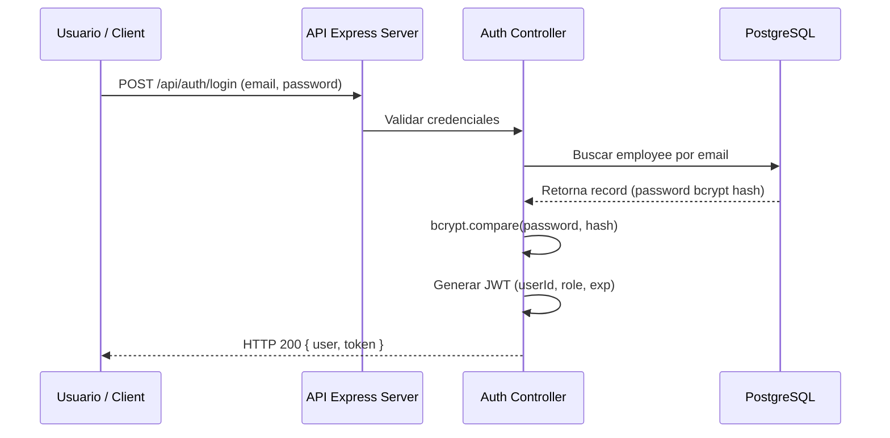

# 02. Autenticación, SSO y Control de Acceso basado en Roles (RBAC)

## 1. Esquema de Autenticación JWT

EMPLIFI utiliza **JSON Web Tokens (JWT)** para la autenticación stateless en peticiones HTTP API.



### 1.1. Estructura del Token JWT
- **Header**: Algoritmo `HS256`, Tipo `JWT`.
- **Payload**: `id`, `email`, `role`, `department`, `iat` (issued at), `exp` (expiration timestamp).
- **Firma**: Firmado con la clave secreta `JWT_SECRET`.

---

## 2. Control de Acceso basado en Roles (RBAC)

El acceso a las distintas rutas y recursos está regulado por el middleware `authorize(roles = [])` y los privilegios definidos en el sistema. EMPLIFI contempla **5 roles de usuario diferenciados**:

| Rol | Alcance de Permisos y Capacidades | Vistas del Frontend Asignadas | Endpoints Clave Autorizados |
|---|---|---|---|
| **`admin`** | Administrador Global. Acceso total a la plataforma, auditoría del sistema, exportación de datos, configuraciones globales, gestión de mantenimiento y seeds. | Panel General Admin, Nómina, Reclutamiento, Reportes, Auditoría, Ajustes | `GET /api/audit`, `GET /api/export/*`, `POST /api/system/maintenance`, `*` |
| **`hr`** | Gestor de Recursos Humanos. Administración de fichas de empleados, beneficios, publicación de vacantes, evaluaciones 360, control de asistencia y reportes analíticos. | Empleados, Asistencia, Reclutamiento, Evaluaciones, Analytics | `/api/employees`, `/api/recruitment`, `/api/performance/templates`, `/api/analytics/*` |
| **`employee`** | Empleado / Colaborador. Acceso restringido a autogestión: marcación GPS de asistencia, solicitudes de ausencias/vacaciones, consulta de roles de pago propios y ejecución de evaluaciones asignadas. | Dashboard Empleado, Mi Asistencia, Mis Ausencias, Mis Pagos, Mis Evaluaciones | `/api/attendance/check-in`, `/api/absences`, `/api/payroll/my-payments`, `/api/performance/my-pending` |
| **`accounting`** | Gestión Contable y Financiera. Acceso al módulo contable aislado, plan de cuentas, asientos contables de nómina, balance de comprobación y centros de costos. | Dashboard Contabilidad, Plan de Cuentas, Asientos Contables, Balances | `/api/accounting/*`, `/api/intelligence` |
| **`entrepreneur`** | Gestión de Emprendimiento e Incubadora. Administración de proyectos de innovación, métricas de emprendimiento, mentorías y miembros de proyecto. | Dashboard Emprendimiento, Formularios de Proyectos, Detalle de Innovación | `/api/entrepreneurship/*`, `/api/intelligence` |

---

## 3. Matriz de Permisos por Módulo y Rol

```
┌───────────────────────────┬───────────┬───────────┬──────────────┬────────────────┬──────────────────┐
│ Módulo / Recurso          │  admin    │    hr     │  employee    │  accounting    │  entrepreneur    │
├───────────────────────────┼───────────┼───────────┼──────────────┼────────────────┼──────────────────┤
│ Gestión Empleados (CRUD)  │     ✓     │     ✓     │    Solo id   │       ✗        │        ✗         │
│ Auditoría (AuditLogs)     │     ✓     │     ✗     │      ✗       │       ✗        │        ✗         │
│ Exportar Excel / CSV      │     ✓     │     ✗     │      ✗       │       ✗        │        ✗         │
│ Nómina (Generar / Config) │     ✓     │     ✓     │      ✗       │    Lectura     │        ✗         │
│ Reclutamiento & Vacantes  │     ✓     │     ✓     │      ✗       │       ✗        │        ✗         │
│ Marcación GPS Asistencia  │     ✓     │     ✓     │      ✓       │       ✓        │        ✓         │
│ Evaluaciones (Tomar)      │     ✓     │     ✓     │      ✓       │       ✓        │        ✓         │
│ Módulo Contabilidad       │     ✓     │     ✗     │      ✗       │       ✓        │        ✗         │
│ Módulo Emprendimiento     │     ✓     │     ✗     │  Solo Miembro│       ✗        │        ✓         │
└───────────────────────────┴───────────┴───────────┴──────────────┴────────────────┴──────────────────┘
```

---

## 4. Seguridad de Sesión y Renovación

- **Expiración de Token**: Los tokens caducan tras un periodo configurable (ej. 8 horas o 24 horas).
- **Restablecimiento Seguro de Contraseña**: Se genera un token aleatorio `resetPasswordToken` con fecha limite `resetPasswordExpires` enviado por correo o entregado temporalmente para el cambio de credenciales.
