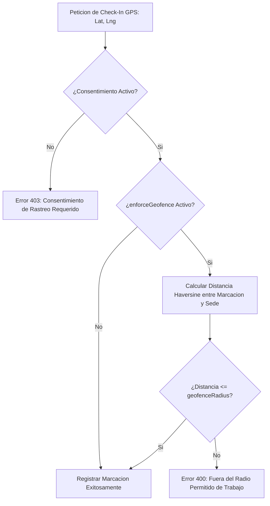

# 02. Motor de Asistencia y Geofencing (GPS)

## 1. Algoritmo de Geofencing y Validación de Marcación GPS

EMPLIFI incluye un **Motor de Marcación Inteligente** que exige la verificación de la ubicación del empleado mediante geolocalización GPS cuando la bandera `enforceGeofence` está activa en su perfil.

### 1.1. Fórmula de Distancia Haversine
El motor calcula la distancia ortodrómica en metros entre las coordenadas recibidas $(lat_1, lon_1)$ y el centro de la sede asignada $(lat_2, lon_2)$:

$$d = 2R \cdot \arcsin\left( \sqrt{ \sin^2\left(\frac{\Delta \phi}{2}\right) + \cos(\phi_1)\cos(\phi_2)\sin^2\left(\frac{\Delta \lambda}{2}\right) } \right)$$

donde $R = 6371000\text{ metros}$.

---

## 2. Clasificación Automática de Marcación y Tolerancia

Al registrar el ingreso (`checkIn`), el motor compara la hora real contra el turno asignado (`Shift` via `EmployeeSchedule`):

- **Tolerancia**: Si el ingreso ocurre dentro de los `toleranceMinutes` (ej. 15 minutos), la marca se registra como a tiempo.
- **Atraso (`isLate`)**: Si el ingreso supera la tolerancia, el sistema marca `isLate = true` y computa los minutos de demora.
- **Salida Temprana (`isEarlyDeparture`)**: Si el egreso registrado (`checkOut`) es menor a la hora de fin del turno.
- **Horas Trabajadas (`workedHours`)**: Computadas automáticamente restando los minutos de descanso configurados (`breakMinutes`).
