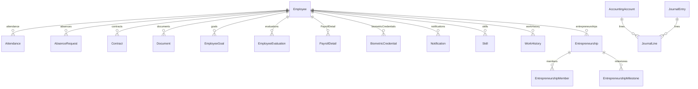

# 01. Esquema Relacional y Especificación del Modelo de Datos Prisma (PostgreSQL)

## 1. Visión General del Modelo Relacional

La base de datos PostgreSQL de EMPLIFI comprende **45 modelos de datos** administrados mediante **Prisma ORM**. Las tablas utilizan convenciones de nombres en minúsculas en plural configuradas mediante la directiva `@@map`.

---

## 2. Catálogo Técnico de los 45 Modelos de Datos

### 2.1. Núcleo de Empleados e Identidad
1. **`Employee` (`employees`)**: Registro principal del personal. Atributos: `id` (cuid), `firstName`, `lastName`, `email` (único), `password` (bcrypt), `department`, `position`, `salary` (AES-256-GCM hex), `role` (`admin`, `hr`, `employee`, `accounting`, `entrepreneur`), `identityCard` (único), `address`, `phone`, `birthDate`, `hireDate`, `civilStatus`, `contractType`, `accountNumber`, `accountType`, `bankName`, `vacationDays`, `isActive`, `workLatitude`, `workLongitude`, `geofenceRadius`, `enforceGeofence`, `trackingConsent`, `trackingConsentDate`, `resetPasswordToken`, `resetPasswordExpires`. Índices: `[email]`, `[department]`.
2. **`Skill` (`skills`)**: Habilidades técnicas del empleado. Atributos: `id`, `name`, `level`, `employeeId`. Relación: `Employee`.
3. **`WorkHistory` (`work_history`)**: Antecedentes laborales. Atributos: `id`, `company`, `position`, `startDate`, `endDate`, `description`, `employeeId`. Relación: `Employee`.

### 2.2. Control Asistencial, Horarios y Geofencing
4. **`Attendance` (`attendance`)**: Registro diario de marcación. Atributos: `id`, `date`, `checkIn`, `checkOut`, `workedHours`, `overtimeHours`, `status`, `entryLatitude`, `entryLongitude`, `exitLatitude`, `exitLongitude`, `breakStart`, `breakEnd`, `isLate`, `isEarlyDeparture`, `ipAddress`, `employeeId`. Clave Única: `[employeeId, date]`.
5. **`Shift` (`shifts`)**: Definición de turnos. Atributos: `id`, `name`, `startTime`, `endTime`, `breakMinutes`, `toleranceMinutes`.
6. **`EmployeeSchedule` (`employee_schedules`)**: Asignación de turno a empleado. Atributos: `id`, `employeeId`, `shiftId`, `startDate`, `endDate`, `daysOfWeek`, `isActive`.
7. **`AbsenceRequest` (`absence_requests`)**: Permisos e incidencias. Atributos: `id`, `type`, `startDate`, `endDate`, `reason`, `status` (`PENDING`, `APPROVED`, `REJECTED`), `evidenceUrl`, `adminComment`, `employeeId`.

### 2.3. Contratos, Documentos y Nómina
8. **`Contract` (`contracts`)**: Contratos laborales. Atributos: `id`, `type`, `startDate`, `endDate`, `salary` (Float), `clauses`, `documentUrl`, `status`, `hasDoubleOvertime`, `hasNightSurcharge`, `employeeId`.
9. **`Document` (`documents`)**: Archivos adjuntos. Atributos: `id`, `type`, `employeeId`, `documentUrl`, `expiryDate`, `mimeType`, `originalName`.
10. **`PayrollConfig` (`payroll_configs`)**: Configuración global de nómina. Atributos: `id`, `workingDays`, `currency`, `validFrom`, `isActive`.
11. **`PayrollItem` (`payroll_items`)**: Rubros configurables. Atributos: `id`, `name`, `type`, `isMandatory`, `percentage`, `fixedValue`, `configId`.
12. **`Payroll` (`payrolls`)**: Cabecera de emisión de nómina. Atributos: `id`, `period`, `endDate`, `status`, `totalAmount`, `paymentDate`.
13. **`PayrollDetail` (`payroll_details`)**: Detalle individual de pago. Atributos: `id`, `payrollId`, `employeeId`, `baseSalary`, `workedDays`, `overtimeHours`, `overtimeAmount`, `bonuses`, `deductions`, `netSalary`.
14. **`EmployeeBenefit` (`employee_benefits`)**: Beneficios individuales. Atributos: `id`, `name`, `amount`, `type`, `frequency`, `status`, `employeeId`.

### 2.4. Evaluaciones de Desempeño y Objetivos
15. **`EvaluationTemplate` (`evaluation_templates`)**: Plantilla de evaluación. Atributos: `id`, `title`, `description`, `period`, `instructions`, `criteria`, `scale`, `isActive`.
16. **`EmployeeEvaluation` (`employee_evaluations`)**: Instancia de evaluación asignada. Atributos: `id`, `templateId`, `employeeId`, `startDate`, `endDate`, `status`, `finalScore`, `feedback`.
17. **`EvaluationReviewer` (`evaluation_reviewers`)**: Evaluador asignado. Atributos: `id`, `evaluationId`, `reviewerId`, `status`, `responses`, `comments`, `score`, `completedAt`.
18. **`EmployeeGoal` (`employee_goals`)**: Objetivos individuales (OKRs/KPIs). Atributos: `id`, `employeeId`, `title`, `description`, `metric`, `targetValue`, `currentValue`, `unit`, `deadline`, `priority`, `status`, `progress`.

### 2.5. Reclutamiento, Selección y Clima Laboral
19. **`JobVacancy` (`job_vacancies`)**: Ofertas de empleo. Atributos: `id`, `title`, `department`, `description`, `requirements`, `benefits`, `salaryMin`, `salaryMax`, `currency`, `location`, `employmentType`, `deadline`, `status`, `postedById`, `evaluationCriteria`.
20. **`JobApplication` (`job_applications`)**: Postulantes. Atributos: `id`, `vacancyId`, `firstName`, `lastName`, `email`, `phone`, `resumeUrl`, `coverLetter`, `status`.
21. **`ApplicationNote` (`application_notes`)**: Notas internas. Atributos: `id`, `applicationId`, `content`, `createdBy`, `createdById`.
22. **`Interview` (`interviews`)**: Entrevistas programadas. Atributos: `id`, `applicationId`, `date`, `type`, `location`, `interviewerId`, `notes`, `status`.
23. **`CandidateEvaluation` (`candidate_evaluations`)**: Calificación de candidatos. Atributos: `id`, `applicationId`, `evaluatorId`, `ratings`, `comments`, `recommendation`, `overallScore`.
24. **`ClimateSurvey` (`climate_surveys`)**: Encuestas de clima laboral. Atributos: `id`, `title`, `startDate`, `endDate`, `isActive`, `description`.
25. **`ClimateResponse` (`climate_responses`)**: Respuestas anónimas. Atributos: `id`, `surveyId`, `department`, `ratings`, `comments`, `npsScore`.

### 2.6. Seguridad, Sistema y Biometría
26. **`AuditLog` (`audit_logs`)**: Registro de auditoría inmutable. Atributos: `id`, `entity`, `entityId`, `action`, `performedBy`, `details`, `ip`, `timestamp`.
27. **`Notification` (`notifications`)**: Notificaciones in-app. Atributos: `id`, `recipientId`, `title`, `message`, `type`, `isRead`, `relatedEntityId`, `relatedEntity`.
28. **`NotificationPreference` (`notification_preferences`)**: Configuración de alertas. Atributos: `id`, `employeeId`, `preferences` (JSON).
29. **`SystemSetting` (`system_settings`)**: Parámetros globales. Atributos: `id`, `maintenanceMode`, `maintenanceScheduled`, `maintenanceMessage`, `biometricEnabled`, `allowedIPs`, `globalLatitude`, `globalLongitude`, `globalRadius`.
30. **`BiometricCredential` (`biometric_credentials`)**: Credencial biométrica (FIDO2/WebAuthn/Hardware). Atributos: `id`, `employeeId`, `credentialId`, `publicKey`, `aaguid`, `counter`, `transports`, `deviceInfo`, `lastVerified`.

### 2.7. Contabilidad Financiera (Módulo `acc_*`)
31. **`AccountingPeriod` (`acc_periods`)**: Períodos contables. Atributos: `id`, `year`, `month`, `startDate`, `endDate`, `status` (`OPEN`, `CLOSED`). Clave Única: `[year, month]`.
32. **`AccountingAccount` (`acc_accounts`)**: Plan de cuentas. Atributos: `id`, `code` (único), `name`, `description`, `type` (`ASSET`, `LIABILITY`, `EQUITY`, `REVENUE`, `EXPENSE`), `level`, `isTransactional`, `parentId`, `isActive`.
33. **`CostCenter` (`acc_cost_centers`)**: Centros de costos. Atributos: `id`, `code` (único), `name`, `description`, `isActive`.
34. **`JournalEntry` (`acc_journal_entries`)**: Libro diario. Atributos: `id`, `entryNumber` (único), `date`, `description`, `type` (`DAILY`, `INCOME`, `EXPENSE`), `status` (`DRAFT`, `POSTED`, `ANNULLED`), `totalDebit`, `totalCredit`, `referenceModule`, `referenceId`.
35. **`JournalLine` (`acc_journal_lines`)**: Apuntes contables. Atributos: `id`, `journalEntryId`, `accountId`, `costCenterId`, `description`, `debit`, `credit`.

### 2.8. Emprendimiento e Incubadora (Módulo `ent_*`)
36. **`Entrepreneurship` (`ent_projects`)**: Proyectos de innovación. Atributos: `id`, `title`, `description`, `industry`, `stage` (`IDEATION`, `VALIDATION`, `MVP`, `SCALING`), `status`, `valuation`, `currency`, `equityAvailable`, `budget`, `expenses`, `innovationScore`, `logoUrl`, `videoPitchUrl`, `pitchNarrative`, `growthMRR`, `growthUsers`, `growthCAC`, `growthLTV`, `ownerId`.
37. **`EntrepreneurshipEquity` (`ent_equities`)**: Distribución accionaria. Atributos: `id`, `projectId`, `holderName`, `percentage`, `role`, `vestingTerms`.
38. **`EntrepreneurshipFundingRound` (`ent_funding_rounds`)**: Rondas de inversión. Atributos: `id`, `projectId`, `roundName`, `amountRaised`, `valuation`, `date`, `investors`.
39. **`EntrepreneurshipInterview` (`ent_interviews`)**: Entrevistas de descubrimiento de cliente. Atributos: `id`, `projectId`, `customerName`, `feedback`, `sentiment`, `insights`.
40. **`EntrepreneurshipTargetMarket` (`ent_target_market`)**: Análisis de mercado. Atributos: `id`, `projectId` (único), `tam`, `sam`, `som`.
41. **`EntrepreneurshipMember` (`ent_members`)**: Integrantes del proyecto. Atributos: `id`, `projectId`, `employeeId`, `externalName`, `externalEmail`, `role`.
42. **`EntrepreneurshipMentor` (`ent_mentors`)**: Mentores asignados. Atributos: `id`, `projectId`, `employeeId`, `mentorName`, `specialty`, `email`.
43. **`EntrepreneurshipMilestone` (`ent_milestones`)**: Hitos de avance Kanban. Atributos: `id`, `projectId`, `title`, `description`, `dueDate`, `completedDate`, `status`, `kanbanColumn`.
44. **`EntrepreneurshipDocument` (`ent_documents`)**: Pitch decks y planes. Atributos: `id`, `projectId`, `title`, `fileUrl`, `fileType`, `version`.
45. **`EntrepreneurshipUpdate` (`ent_updates`)**: Bitácora de actualizaciones. Atributos: `id`, `projectId`, `title`, `content`, `type`.
