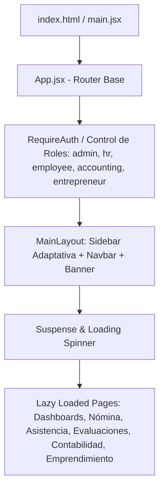

# 01. Arquitectura Frontend (React + Vite)

## 1. Visión General de la Aplicación Cliente (SPA)

El cliente web de EMPLIFI es una **Single Page Application (SPA)** moderna construida sobre **React 18** y empaquetada mediante **Vite**. La arquitectura promueve la carga bajo demanda (*code splitting* con `React.lazy` y `Suspense`), renderizado ágil y desacoplamiento visual por rol de usuario.

---

## 2. Enrutamiento y Protección de Rutas

El enrutamiento está administrado por **React Router DOM v6** en `App.jsx`.

### 2.1. Estrategia de Carga Eager vs Lazy
- **Páginas Eager (Carga Inmediata)**: `Home.jsx` (Landing), `Login.jsx` (Autenticación), `AdminDashboard.jsx`, `EmployeeDashboard.jsx`.
- **Páginas Lazy (Carga Bajo Demanda)**: Reducen el tamaño del bundle inicial. Incluye vistas especializadas (`PayrollGenerator.jsx`, `AttendancePage.jsx`, `RecruitmentDashboard.jsx`, `AccountingDashboard.jsx`, `EntrepreneurshipDashboard.jsx`).

### 2.2. Guardias de Autenticación (`RequireAuth`)
El componente de orden superior `RequireAuth` valida la presencia de `user` y `token` en el estado o `localStorage`, verificando la matriz de roles permitidos (`admin`, `hr`, `employee`, `accounting`, `entrepreneur`). 

- Si un usuario con rol `employee` intenta ingresar a `/admin`, el guardia lo redirige automáticamente a `/empleado`.
- Si un usuario desautenticado intenta acceder a cualquier ruta protegida, es redirigido a `/login`.
