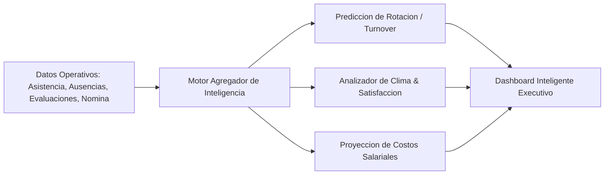

# 01. Módulo de Inteligencia, Analítica y Reportes Predictivos

## 1. Visión General del Módulo de Inteligencia (`/api/intelligence`)

El módulo de **Inteligencia y Analytics en EMPLIFI** transforma los datos operativos de asistencia, evaluaciones, nómina y reclutamiento en indicadores estratégicos para la toma de decisiones ejecutivas en Recursos Humanos.

---

## 2. Indicadores Clave y Reportes Generados

### 2.1. Métricas de Rotación de Personal (Turnover Rate)
- **Tasa de Rotación Mensual**: $$\text{Tasa Rotación (\%)} = \left(\frac{\text{Bajas en el Periodo}}{\frac{\text{Personal Inicial} + \text{Personal Final}}{2}}\right) \times 100$$
- **Factor de Riesgo Fuga de Talento**: Identificación de patrones de bajas voluntarias vinculados a la antigüedad, departamento o evaluaciones de desempeño estancadas.

### 2.2. Análisis de Clima Laboral y Satisfacción
- Procesamiento de encuestas internas con cálculo de **eNPS (Employee Net Promoter Score)**.
- Mapeo de áreas críticas con baja satisfacción o sobrecarga de horas extras acumuladas.

### 2.3. Proyección Predictiva de Costos Salariales
- Modelado de tendencias de gasto en horas suplementarias y festivas.
- Proyección de provisiones para décimos, vacaciones acumuladas y fondos de reserva.
